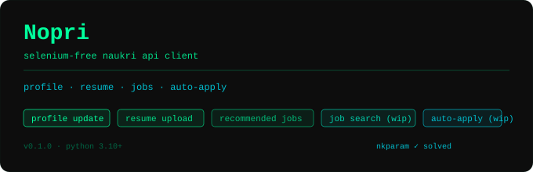

<p align="center">
  
</p>

# CareerFlow AI

Personal Naukri automation workspace built on top of Nakari.

Use this repo as your private job-search agent first. It can refresh your
Naukri profile, upload your resume, fetch jobs, score them against your
backend/AI automation profile, create an application plan, and apply only when
you explicitly confirm live mode.

## Your Workflow

1. Install dependencies:

```bash
python -m venv .venv
source .venv/bin/activate
pip install -r requirements.txt
```

2. Create your private env file:

```bash
cp .env.example .env
```

Fill in:

```env
USERNAME=your_naukri_email_or_mobile
PASSWORD=your_naukri_password
OPENAI_API_KEY=your_openai_api_key
```

`OPEN_API_KEY` also works because the upstream agent uses that name.

3. Put your latest resume here:

```text
resumes/current_resume.pdf
```

4. Review your targeting config:

```text
config/candidate_profile.json
```

It is currently seeded for a backend/AI automation profile: Python, Node.js,
APIs, AWS, Docker, OpenAI/LangChain/RAG, automation, scraping, and platform
tooling.

5. Generate a ranked plan without applying:

```bash
python careerflow.py plan
```

If you do not want to spend OpenAI credits:

```bash
python careerflow.py plan --local-score
```

6. Dry-run applications:

```bash
python careerflow.py apply
```

This fetches and scores jobs but does not submit applications.

7. Submit real applications only when ready:

```bash
python careerflow.py apply --confirm-apply
```

8. Preview profile refresh:

```bash
python careerflow.py refresh-profile
```

Submit the profile headline/summary/resume update only when ready:

```bash
python careerflow.py refresh-profile --confirm-profile-update
```

## Offline Internship Mode

The internship mode is separate from the normal job mode because internships
need different keywords and should not use the backend job scorer that vetoes
intern roles.

Stable resume variants are stored under `resumes/` and ignored by git. The
matcher chooses between backend intern, full-stack intern, AI systems, platform,
digital technology, general software intern, backend/systems, and research
systems variants for each internship.

You can create the internship plan without login because the search endpoint
does not require a bearer token.

Create an offline-only internship plan:

```bash
.venv/bin/python careerflow.py internship-plan
```

Request OTP only when you are ready to use the apply flow:

```bash
.venv/bin/python careerflow.py send-otp
```

The plan is saved to:

```text
internship_plan.csv
```

It includes the selected resume profile and application keywords for each
internship.

Dry-run the apply flow:

```bash
.venv/bin/python careerflow.py internship-apply --otp YOUR_OTP
```

Submit live internship applications:

```bash
.venv/bin/python careerflow.py internship-apply --otp YOUR_OTP --confirm-apply
```

Live internship apply uploads the matched resume before applying when the
selected resume changes. Questionnaire jobs are skipped unless enabled in
`config/internship_profile.json`.

## Server Hosting

Use a stable IP. Naukri sessions are IP-bound and cloud/datacenter IPs may
trigger MFA or blocking.

Local server setup:

```bash
python -m venv .venv
source .venv/bin/activate
pip install -r requirements.txt
cp .env.example .env
```

Run manually:

```bash
scripts/run_internship_plan.sh --otp YOUR_OTP
```

Systemd templates are in:

```text
deploy/systemd/
```

Docker is available for environments where `httpcloak` has a compatible wheel:

```bash
docker compose run --rm careerflow
```

## Render Deployment & Keep-Alive (24/7 Setup)

This repository is optimized for deployment on **Render's Free Tier** with a double-layered keep-alive mechanism to prevent the service from spinning down (which usually happens after 15 minutes of inactivity).

### 1. Render Setup (Manual Web Service - 100% Free)

To avoid costs from Render's database plans (which expire and charge after 90 days), you can deploy as a standalone **Web Service** and connect a free, permanent PostgreSQL database from providers like **Neon.tech** or **Supabase**:

1. **Get a Free Database:**
   - Sign up for a free account at [Neon.tech](https://neon.tech/) or [Supabase.com](https://supabase.com/).
   - Create a project and copy your database connection string (e.g., `postgresql://...`).
2. **Create Render Web Service:**
   - Go to the Render Dashboard, click **New +** and select **Web Service**.
   - Connect your GitHub repository.
   - Choose **Python** as the runtime.
   - Set **Build Command**: `pip install -r requirements.txt`
   - Set **Start Command**: `python server.py`
3. **Configure Environment Variables on Render:**
   - `DATABASE_URL`: Set this to the connection string you copied from Neon or Supabase.
   - `USERNAME`: Your Naukri username.
   - `PASSWORD`: Your Naukri password.
   - `OPENROUTER_API_KEY`: Your OpenAI/OpenRouter API key.
   - `RENDER_EXTERNAL_URL`: Set this to your Web Service URL (e.g. `https://your-app-name.onrender.com`).

### 2. Double-Layered Keep-Alive Setup

#### Layer 1: Internal Self-Pinger (Built-in)
* When the web service is running, it spawns a background thread that automatically pings its own public URL (`/api/status`) every **4 minutes**.
* Because this is routed as an incoming HTTP request via Render's routing layer, it resets the 15-minute inactivity counter and keeps the service active.

#### Layer 2: External GitHub Action Pinger (Pre-configured)
* If the app ever goes to sleep (e.g. after a Render restart or update), the internal thread stops.
* We have pre-configured a GitHub Actions workflow in `.github/workflows/keep-alive.yml`.
* **To activate it**:
  1. Go to your GitHub repository -> **Settings** -> **Secrets and variables** -> **Actions**.
  2. Click **New repository secret** and add a secret named `RENDER_APP_URL` with your Render URL (e.g., `https://careerflow-ai-dashboard.onrender.com`).
  3. The workflow will run automatically every **5 minutes** to ping the app, wake it up, and trigger the internal self-pinging cycle.

#### Layer 3: Alternative Cron-Job.org (Recommended Free Option)
If you want 100% reliable external pinging with zero delays:
1. Go to [cron-job.org](https://cron-job.org/) (completely free).
2. Create a cron job that targets your Render dashboard status endpoint: `https://YOUR-APP-NAME.onrender.com/api/status`.
3. Set the execution interval to run every **5 minutes**.

---

## Safety Defaults

- Real applications require `--confirm-apply`.
- Profile/resume updates require `--confirm-profile-update`.
- Applied jobs are logged in `applied_jobs.csv`.
- Ranked jobs are written to `careerflow_plan.csv`.
- Local private files, resumes, score caches, and application logs are ignored
  by git.
- Avoid cloud runners and GitHub Actions for Naukri login; the upstream README
  notes that IP changes and datacenter IPs can trigger MFA or blocking.

## Upstream Notice

This project includes code adapted from Traverser25/NopeRi. The upstream
repository did not include a visible license file when this workspace was
initialized, so keep attribution and review licensing before publishing a
standalone public version.

---

# Upstream: Noperi

A lightweight and Selenium-free Python API client for Naukri.com, designed to help you update your profile, upload your resume, search jobs, and apply to jobs (easy apply) programmatically.

---

**Status:** 🟢 Working (Last tested: May 2026)

---

## ✨ Features

| Feature | Status |
|---|---|
| Login & session management (Bearer token) | ✅ Working |
| Resume upload (PDF) | ✅ Working |
| Profile update (headline, name, summary) | ✅ Working |
| Recommended jobs feed | ✅ Working |
| `nkparam` token harvester (Selenium utility) | ✅ Working |
| `nkparam` token generator (pure API, no Selenium) | ✅ Working |
| Job search (`/jobapi/v3/search`) | ✅ Working |
| Job details  (`jobapi/v1/job/`) | ✅ Working |
| One-click job apply | ✅ Working |
| Job questionnaire while applying| ✅ Working Partially (harcoded answer) |
| OTP login/MFA | ✅ Working |


> **Updated on April 13 2026**  
> **No Selenium required** for core features.  
> The `nkparam` token is generated via API.  
> Selenium-based harvester is kept only as a backup utility.

> **No Selenium required** for features 1–4. The Selenium script is only needed as a helper to harvest fresh `nkparam` tokens for the search endpoint.

---

## 🗂️ Project Structure

```
naukri-api-client/
├── main.py                     # Entry point — demo of all features
├── nkPool.txt                  # Pool of captured nkparam tokens
├── .env                        # Credentials 
├── src/
│   ├── client/
│   │   ├── naukri_client.py    # Core auth + profile + resume client
│   │   ├── job_client.py       # Recommended jobs + search + apply
│   │   └── session.py          # requests.Session factory
│   ├── config/
│   │   └── constants.py        # URLs, regex patterns, app IDs
│   ├── exceptions/
│   │   └── exceptions.py       # Custom exception classes
│   ├── models/
│   │   └── models.py           # Dataclasses: Job, NaukriSession, etc.
│   └── utils/
│       ├── extractors.py       # HTML / JS parsing helpers
│       └── request_helper.py   # Exponential-retry decorator
        ├── get_Nkparam.py      # Selenium helper to harvest nkparam tokens
        ├── nkparam_generator.py   #generate nkparam tokens 
```

---

## ⚠️ IP & Hosting Advice

Naukri fingerprints IPs for every request. Many cloud providers trigger MFA or get blocked.

**Avoid:**
- Azure (all regions)
- GitHub Actions / CI
- Some Google Cloud regions
- Datacenter IP ranges

**Works:**
- AWS (EC2 with Elastic IP)
- Home broadband / personal IP (best)
- Mobile hotspot (testing)
- Residential proxy

**Note:**
- Sessions are IP-bound — changing IP will invalidate login
- Avoid GitHub Actions completely (IP pool is flagged)


## ⚙️ Installation

**Requirements:** Python 3.10+

```bash
git clone https://github.com/Traverser25/NopeRi.git
cd Noperi
pip install -r requirements.txt
```

Create a `.env` file in the project root:

```env
USERNAME=your_naukri_email@example.com
PASSWORD=your_naukri_password
```

---
## 🚀 Quick Start 
        you can simply run `main.py` also

        ```python
        from src.client.naukri_client import NaukriLoginClient
        from src.client.job_client import NaukriJobClient
        from dotenv import load_dotenv
        import os
        import time

        load_dotenv()

        # 1. Login
        client = NaukriLoginClient(os.getenv("USERNAME"), os.getenv("PASSWORD"))
        client.login()

        # 2. Upload resume
        client.update_resume("path/to/your_resume.pdf")

        # 3. Update profile headline
        client.update_profile(headline="Backend Engineer | Python · Node.js · AWS")

        # 4. Update profile summary
        client.update_profile(summary="Experienced engineer with 2+ years building scalable APIs.")

        # 5. Job client
        jc = NaukriJobClient(client)

        # 6. Fetch recommended jobs
        jobs = jc.get_recommended_jobs()
        for job in jobs:
            print(job.title, "—", job.company)

        # 7. Search jobs
        jobs = jc.search_jobs(keyword="Node.js developer", location="Hyderabad", experience=2)

        # 8. Apply to jobs (easy apply)
        for job in jobs:
            mandatory = job.tags[:2] if job.tags else []
            optional  = job.tags[2:] if len(job.tags) > 2 else []

            try:
                result = jc.apply_job(
                    job,
                    mandatory_skills=mandatory,
                    optional_skills=optional,
                    source="recommended"
                )

                job_result = (result.get("jobs") or [{}])[0]

                # Skip jobs with questionnaire
                if job_result.get("questionnaire"):
                    print("Skipped (questionnaire required):", job.title)
                    continue

                print("Applied:", job.title)

            except Exception as e:
                print("Failed:", job.title, "|", e)

            time.sleep(2)


---

## 📖 API Reference

### `NaukriLoginClient`

| Method | Description |
|---|---|
| `login()` | Authenticates and stores the Bearer token + session cookies |
| `update_resume(file)` | Uploads a PDF resume; accepts a file path (`str`) or a file-like object |
| `update_profile(headline, name, summary)` | Updates one or more profile fields (all arguments are optional) |
| `fetch_profile_id()` | Returns your Naukri profile ID (cached after first call) |
| `get_form_key2()` | Extracts the internal `formKey` from Naukri's JS bundle (cached) |

### `NaukriJobClient`

| Method | Description |
|---|---|
| `get_recommended_jobs()` | Returns a list of `Job` objects personalised to your profile |
| `search_jobs(keyword, location, page, experience, ...)` | Returns job results using the search endpoint |
| `apply_job(job)` | Applies to a job programmatically |

### `Job` model

```python
@dataclass
class Job:
    job_id:      str
    title:       str
    company:     str
    location:    str
    experience:  str
    salary:      str
    posted_date: str
    apply_link:  str
    description: str
    tags:        list[str]
```

---

## 🔑 The `nkparam` Problem (and Current Solution)

Naukri's job-search endpoint (`/jobapi/v3/search`) requires a request header called `nkparam`.  
This is not just a random token — it is essentially an **encrypted/signature key** generated using:
- current timestamp (time-based salt)
- session-related data
- page/context-specific parameters

The logic exists inside Naukri’s obfuscated JavaScript bundle, which makes it hard to reverse directly.

If `nkparam` is missing or invalid, the API returns `403 Forbidden`.

---

### ✅ Current Solution

We now generate `nkparam` directly via API logic (no browser required).


---

### 🧰 Fallback (Optional)

A Selenium-based harvester is still available as a backup:

**`nk_param_getter.py`**
- Opens Chrome
- Captures network requests
- Extracts valid `nkparam`
- Stores in `nkPool.txt`


---

## 🤖 Automated Job Application Agent

For a fully automated, AI-powered job application workflow, use:

```bash
python apply_agent.py
```

The agent is built on top of `NaukriLoginClient` and `NaukriJobClient`, so all authentication, session management, cookies, and token handling are already taken care of automatically.

---

### ✨ What the Agent Does

The workflow runs end-to-end automatically:

1. Logs into Naukri using your `.env` credentials
2. Searches jobs using curated backend-focused keywords
3. Scores each job using an AI model (`OpenAI`)
4. Automatically applies to jobs that pass the score threshold
5. Handles basic job questionnaires using predefined answers
6. Skips external company-site applications
7. Prevents duplicate applications using a local CSV log
8. Displays a colored terminal dashboard with live progress

---

### ⚙️ Prerequisites

Add your OpenAI API key to the `.env` file:

```env
OPEN_API_KEY=your-openai-api-key
```

Your `.env` should now look like:

```env
USERNAME=your_naukri_email@example.com
PASSWORD=your_naukri_password
OPEN_API_KEY=your-openai-api-key
```

---

### 🧠 Default Search Strategy

The agent fetches jobs using curated backend-development queries such as:

- Node.js Developer
- Python Backend Developer
- Backend Engineer
- API Developer
- Full Stack Developer

It also filters using:
- Experience level
- Job freshness
- Multiple result pages

---

### 🔧 Configuration

You can customize the behaviour directly inside `apply_agent.py`:

| Variable | Purpose |
|---|---|
| `BQUERIES` | List of job search keywords |
| `EXPERIENCE_LEVELS` | Experience filters |
| `PAGES` | Number of search-result pages |
| `JOB_AGE` | Max age of jobs to consider |
| `SCORE_THRESHOLD` | Minimum AI score required before applying |

---

### 📂 Application Tracking

The agent keeps track of already-applied jobs using:

```bash
applied_jobs.csv
```

This ensures:
- No duplicate applications
- Safe repeated runs
- Persistent local history

---

### 🖥️ Terminal Dashboard

The agent displays a live terminal dashboard showing:

- Login status
- Jobs fetched
- AI evaluation score
- Apply success/failure
- Questionnaire detection
- Final application summary

Example:

```text
[FETCH] Backend Engineer — Hyderabad
[AI SCORE] 8.7/10
[APPLY] Success
```

---

 External company-site applications | ❌ Skipped intentionally |

---

### 💡 Example Workflow

```bash
python apply_agent.py
```

Typical flow:

```text
Login Successful
Fetching Jobs...
Scoring with AI...
Applying...
Saved to applied_jobs.csv
Run Complete
```

---

## ⚠️ Disclaimer

This project is intended for personal automation of your **own** Naukri account. Use responsibly and in accordance with [Naukri's Terms of Service](https://www.naukri.com/termsAndConditions). The authors are not affiliated with Naukri / InfoEdge India Ltd.

---

## 🛣️ Roadmap

- [x] Complete job-search endpoint integration
- [x] Complete one-click job-apply flow

- [ ] Add async support (`httpx` / `aiohttp`)
- [ ] CLI interface

---

## 🤝 Contributing

Pull requests are welcome!
OTP/MFA login is now fully supported. The main area that could use help is **refactoring and cleanup** — improving code structure and formatting without breaking existing functionality.

---
